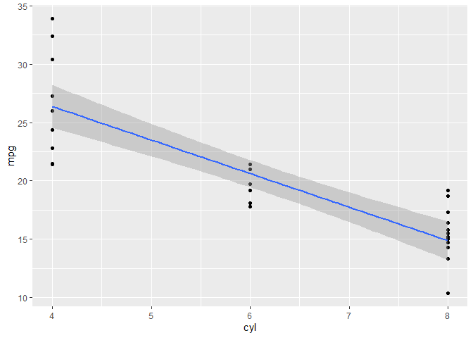

Assignment B-1
================
Eve Chen
11/2/2021

### Create the Function

I would like to create a function that create an `lm` object and plot
the graph that can be repeated when choosing different variables. The
function takes in two arguments from the provided tibble column
variables and creates a graph based on the linear model from the
variables.

The function is generated below:

``` r
library(tidyverse)
```

    ## Warning: package 'tidyverse' was built under R version 4.1.1

    ## -- Attaching packages --------------------------------------- tidyverse 1.3.1 --

    ## v ggplot2 3.3.5     v purrr   0.3.4
    ## v tibble  3.1.4     v dplyr   1.0.7
    ## v tidyr   1.1.3     v stringr 1.4.0
    ## v readr   2.0.1     v forcats 0.5.1

    ## Warning: package 'tibble' was built under R version 4.1.1

    ## Warning: package 'readr' was built under R version 4.1.1

    ## -- Conflicts ------------------------------------------ tidyverse_conflicts() --
    ## x dplyr::filter() masks stats::filter()
    ## x dplyr::lag()    masks stats::lag()

``` r
#' A Linear Models Visualization Function
#'
#' Select two columns from a data frame: two numeric columns for fitting linear models and visualization.
#' You can also decide whether to remove N/A values from geom_point, as well as choosing the color and size of axis titles. 
#' The function must have numeric x and y arguments and will stop if given other data types.
#'
#' @param data Tibble or data frame that you want to select from.
#' @param x Numeric column name. This will be the x variable being used for the model and the graph.
#' @param y Numeric column name. This will be the y variable being used for the model and the graph.
#' @param na.rm Logical value to decide whether or not to remove `NA` values when graphing. This is named consistently with `ggplots` functions. If `FALSE`, the default, missing values are removed with a warning. If `TRUE`, missing values are silently removed.
#' @return The model graph as an class of `ggplot` object. This plot is determined by the selected numeric columns of the data. 
#' Throws an error if `x` and `y` are not the numeric type.

plot_lm <- function (data, x, y, na.rm = TRUE) {
  calculations <- dplyr::summarise(
    data,
    is_numeric_x = is.numeric({{ x }}),
    class_x = class({{ x }}),
    is_numeric_y = is.numeric({{ y }}),
    class_y = class({{ y }})
  )
  
  if (!calculations$is_numeric_x) {
    stop("The `x` column must be numeric, but is of class ",
         calculations$class_x)
  }

  if (!calculations$is_numeric_y) {
    stop("The `y` column must be numeric, but is of class ",
         calculations$class_y)
  }
  
  graph <- ggplot(data, aes({{ x }}, {{ y }}), na.rm = na.rm) +
  geom_point() +
  geom_smooth(method = "lm") 
  
  return (graph)
}
```

### Examples of Usage

1.  Example that works: Plot the relationship between `cyl` - Number of
    cylinders and `mpg` - Miles/(US) gallon of the `mtcars` data.

``` r
plot_lm(mtcars, cyl, mpg, na.rm = T)
```

    ## `geom_smooth()` using formula 'y ~ x'

<!-- -->

1.  Example of errors: Choose the `continent` column from the
    `gapminder` dataset as the `x` variable. It’s not `numeric` so can’t
    fit in the linear model.

``` r
plot_lm(gapminder, continent, lifeExp)
```

    ## Error in dplyr::summarise(data, is_numeric_x = is.numeric({: object 'gapminder' not found

### Formally test the Function

Given that the columns must be numeric for the x and y axis, I am
testing if there my stop error function is working when the data
provided is not numeric. I also test that the scales for x and y are
labelled corrected from the column names provided.

``` r
library(gapminder)
```

    ## Warning: package 'gapminder' was built under R version 4.1.1

``` r
library(testthat)
```

    ## Warning: package 'testthat' was built under R version 4.1.1

    ## 
    ## Attaching package: 'testthat'

    ## The following object is masked from 'package:dplyr':
    ## 
    ##     matches

    ## The following object is masked from 'package:purrr':
    ## 
    ##     is_null

    ## The following objects are masked from 'package:readr':
    ## 
    ##     edition_get, local_edition

    ## The following object is masked from 'package:tidyr':
    ## 
    ##     matches

``` r
## Incorrect column types throw an error
test_that("Non-numeric values for x axis", {
  expect_error(plot_lm(gapminder, continent, lifeExp)) # x is factor type
  expect_error(plot_lm(gapminder, lifeExp, continent)) # y is factor type
  expect_error(plot_lm(gapminder, continent, country)) # both factor types
})
```

    ## Test passed

``` r
## Incorrect label name of the data columns 
test_that("Columns are selected incorrectly",{
  expect_error(plot_lm(gapminder, yeer, lifeExp)) # x is wrongly spelled
  expect_error(plot_lm(gapminder, year, lifeAxp)) # y is wrongly spelled
})
```

    ## Test passed
