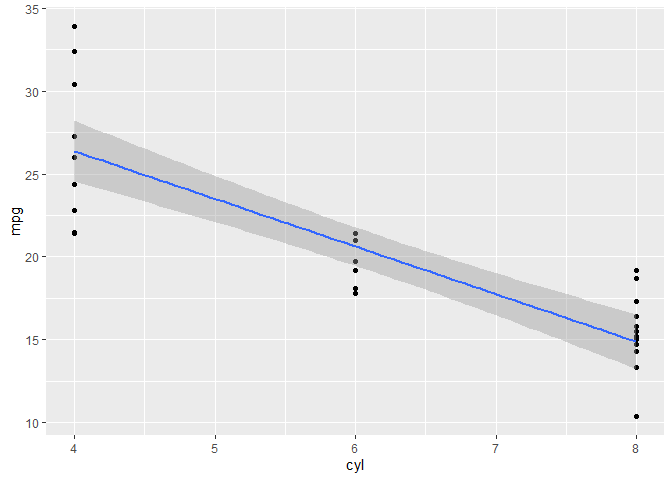

<!-- README.md is generated from README.Rmd. Please edit that file -->

# lmPlot

<!-- badges: start -->
<!-- badges: end -->

The goal of lmPlot is to fit two variables from a given data frame into
a linear model of and visualize it.

The function `plot_lm()` takes in two arguments from the provided tibble
column variables and creates a graph based on the linear model from the
variables.

## Installation

lmPlot is not yet on CRAN. You can install the development version from
[GitHub](https://github.com/) with:

``` r
# install.packages("devtools")
devtools::install_github("stat545ubc-2021/lmPlot")
```

## Example

This is a basic example which shows you how to solve a common problem:

``` r
library(lmPlot)
plot_lm(mtcars, cyl, mpg, na.rm = T)
#> `geom_smooth()` using formula 'y ~ x'
```


